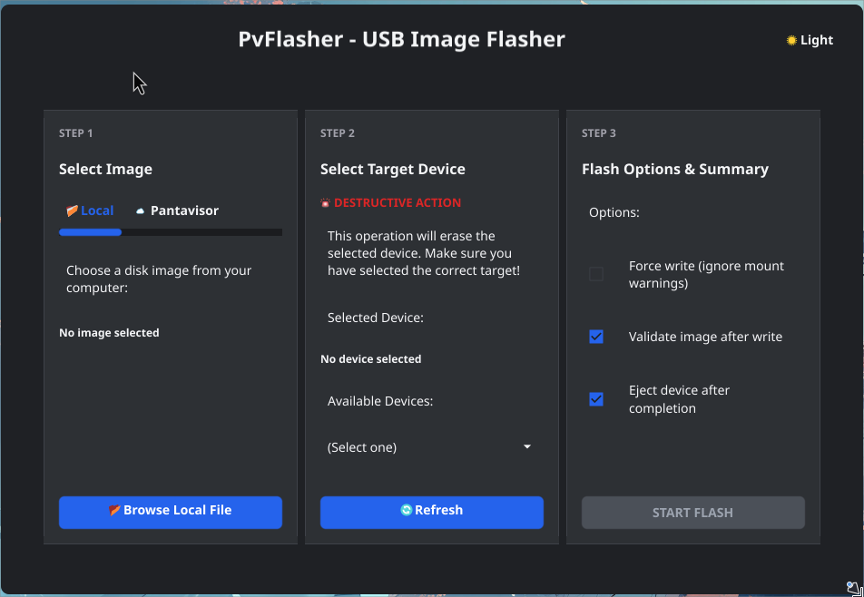

# pvflasher

**pvflasher** is an open-source flashing tool from [Pantacor](https://pantacor.com/) for writing operating system images to removable media. It can flash generic OS images and `.bmap`-accelerated image layouts from any distribution, with built-in [Pantavisor](https://pantavisor.io/) image browsing in the GUI.


## 🚀 Features

*   **Cross-Platform**: Works on Linux, Windows, and macOS (macOS support in progress). Windows users should run with Administrator privileges for raw disk access.
*   **Fast Flashing**: Uses `.bmap` (block map) files to flash only the blocks that contain data, significantly reducing flash time compared to `dd`.
*   **Image Support**: Supports raw images (`.img`, `.iso`, `.wic`) and direct flashing from compressed archives (`.gz`, `.bz2`, `.xz`, `.zst`, `.zip`) without prior decompression.
*   **Safety**: Built-in checks to prevent flashing to system drives or mounted devices (unless forced).
*   **Verification**: Automatic SHA256/SHA512 checksum verification of written data.
*   **Pantavisor Integration**: Browse and download Pantavisor images directly from the GUI.
*   **Dual Interface**:
    *   **CLI**: Powerful command-line tool for scripts and power users.
    *   **GUI**: Native desktop application built with Fyne.

## Pantacor + Pantavisor

**pvflasher** is another open-source project from [Pantacor](https://pantacor.com/). It is a general-purpose image flasher for removable media, and the GUI also includes a dedicated [Pantavisor](https://pantavisor.io/) flow so you can choose a release channel, version, and device profile, then download and flash that image in one place.

## 🪟 Windows Support

**pvflasher** provides native support for Windows. To flash images to physical drives, the application requires **Administrator privileges**.

*   **GUI**: Will prompt for elevation automatically when necessary.
*   **CLI**: Ensure you run your terminal (Command Prompt or PowerShell) as Administrator.
*   **Device Paths**: On Windows, devices are identified as `\\.\PhysicalDriveN`. The CLI `list` command will help you identify the correct drive number.

## ☁️ Pantavisor Images

The **pvflasher** GUI includes built-in support for downloading and flashing **Pantavisor** images. You can select from different channels, versions, and target devices directly within the application. The image is automatically downloaded, validated, and flashed to your USB drive.

Images are cached locally to avoid redundant downloads:
*   **Linux/macOS**: `~/.pvflasher/images/`
*   **Windows**: `%USERPROFILE%\.pvflasher\images\`

## 📥 Installation

### Quick Install

**Linux / macOS:**
```bash
# Install latest
curl -fsSL https://raw.githubusercontent.com/pantavisor/pvflasher/main/scripts/install.sh | bash

# Install specific version
curl -fsSL https://raw.githubusercontent.com/pantavisor/pvflasher/main/scripts/install.sh | bash -s -- v0.0.1
```

**Windows (PowerShell):**
```powershell
# Install latest
powershell -c "irm https://raw.githubusercontent.com/pantavisor/pvflasher/main/scripts/install.ps1 | iex"

# Install specific version
powershell -c "& { $(irm https://raw.githubusercontent.com/pantavisor/pvflasher/main/scripts/install.ps1) } -Version v0.0.1"
```

### Building from Source

See the [Developer Guide](docs/DEVELOPER_GUIDE.md) for detailed build instructions.

## 📖 Usage

### GUI

Simply run the application:

```bash
pvflasher
```



1.  **Select Image**: Drag & drop or browse for your image file.
2.  **Select Device**: Choose the target USB drive from the list.
3.  **Flash**: Click the flash button to start.

### CLI

The `pvflasher` CLI offers commands to copy images, create bmaps, list devices, and verify flashes.

**List Devices:**
```bash
pvflasher list
```

**Flash an Image:**
```bash
# Auto-detects .bmap file if it exists alongside the image
pvflasher copy image.img.gz /dev/sdX
```

See the [User Guide](docs/USER_GUIDE.md) for full command documentation.

## 📚 Documentation

*   [User Guide](docs/USER_GUIDE.md) - Detailed usage instructions.
*   [Developer Guide](docs/DEVELOPER_GUIDE.md) - How to build and contribute.
*   [Troubleshooting](docs/TROUBLESHOOTING.md) - Common issues and solutions.

## 📄 License

This project is licensed under the MIT License - see the [LICENSE](LICENSE) file for details.
