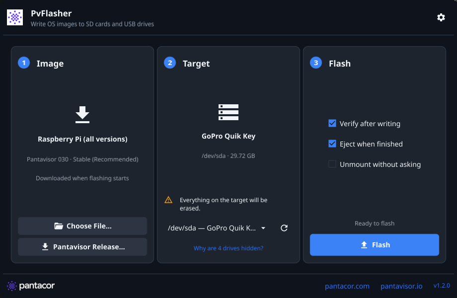
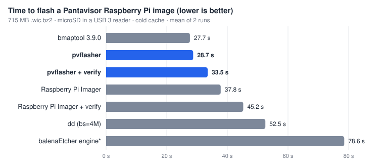
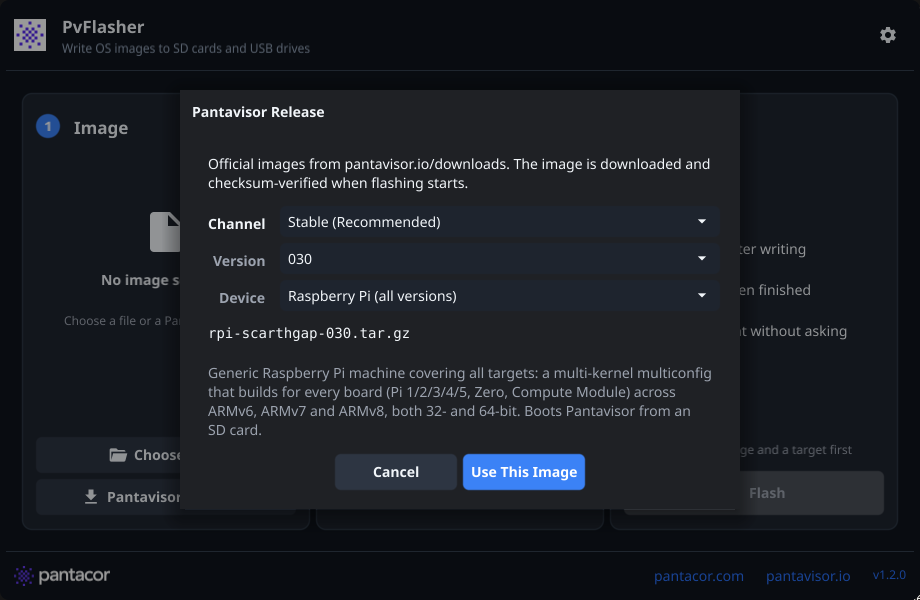
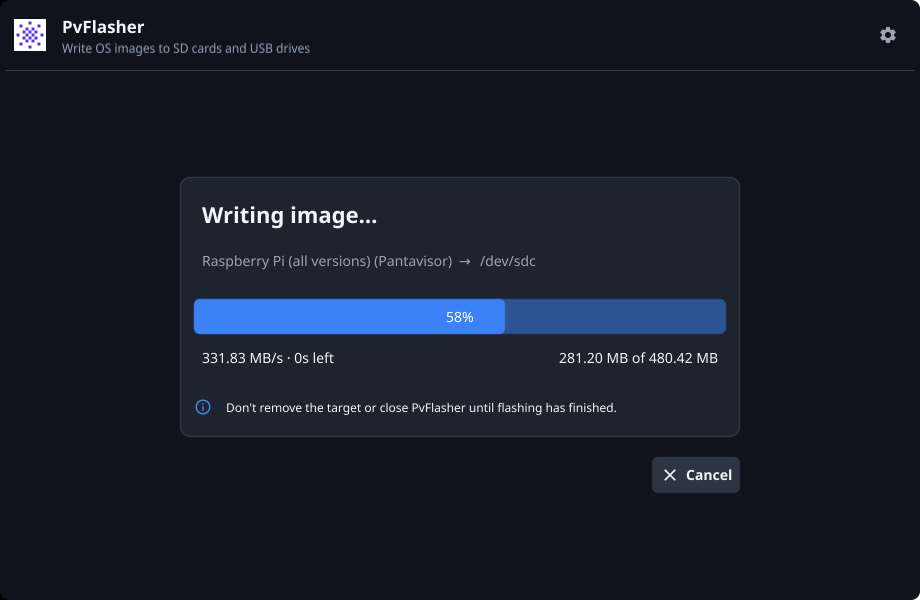
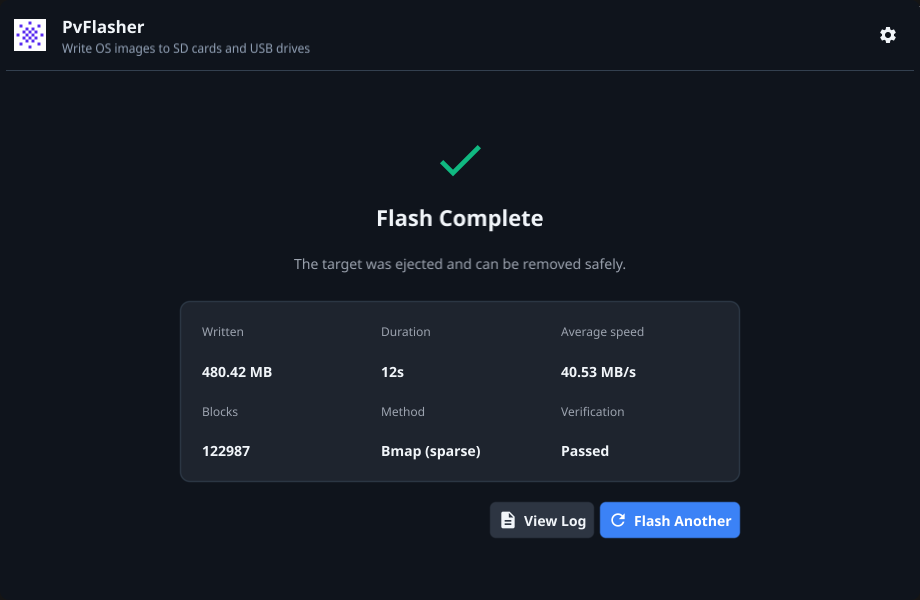
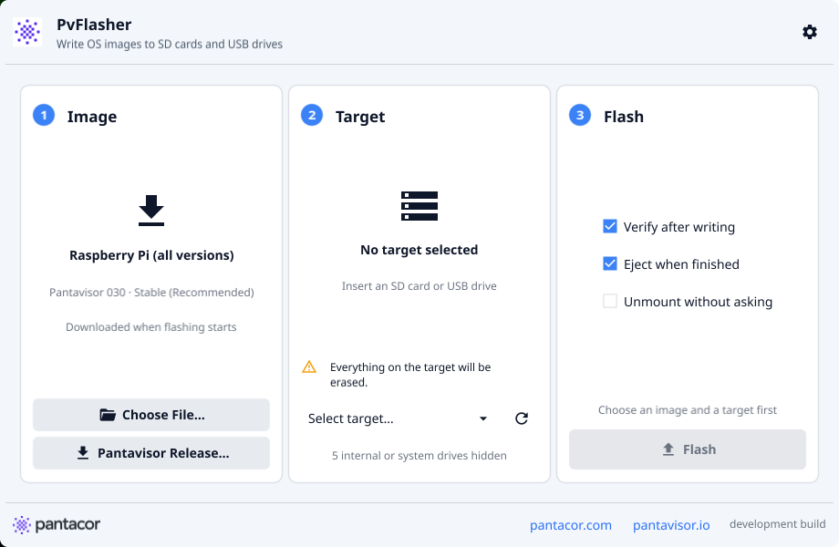

# pvflasher

**pvflasher** is an open-source flashing tool from [Pantacor](https://pantacor.com/) for writing operating system images to removable media. It can flash generic OS images and `.bmap`-accelerated image layouts from any distribution, with built-in [Pantavisor](https://pantavisor.io/) image browsing in the GUI.



## ⚡ Performance

<picture>
  <source media="(prefers-color-scheme: dark)" srcset="docs/images/benchmark-dark.svg">
  
</picture>

*   **Verified in 33.5 s**: pvflasher writes the image *and* reads every written block back against its checksums faster than Raspberry Pi Imager writes it without checking (37.8 s), and **26% faster** than Raspberry Pi Imager with verification.
*   **1.8× faster than `dd`** and **2.7× faster than the balenaEtcher engine** (all without verification): the `.bmap` skips the 30% of the image that is empty, and decompression runs in parallel with the writes.
*   **On par with `bmaptool`** (27.7 s), the reference bmap implementation. bmaptool checks the *image* against the bmap checksums as it reads it, which catches a corrupted download, but it never reads the card back, so a failed write or a fake/failing card goes unnoticed. pvflasher's verify step reads back every written block from the card and checks it, and also adds a GUI and Windows/macOS support.

<details>
<summary>Method and raw numbers</summary>

Pantavisor 030 `rpi-scarthgap` image (`.wic.bz2`, 390 MB compressed, 715 MB raw, 504 MB mapped by the bmap), written to a microSD card in a USB 3 (5 Gb/s) reader on Linux 7.2, 16 CPUs. The page cache is dropped before every run, and each run is timed until the tool exits with the data on the card. Two runs per tool; [raw results](docs/benchmarks/2026-09-rpi-usb3.csv).

| Tool | What it checks | Mean |
| :--- | :--- | ---: |
| bmaptool 3.9.0 | the source image only (no read-back, so write errors are not detected) | 27.7 s |
| pvflasher | no | 28.7 s |
| **pvflasher + verify** | **reads back every written block against the bmap checksums** | **33.5 s** |
| Raspberry Pi Imager | no | 37.8 s |
| Raspberry Pi Imager + verify | reads back the card | 45.2 s |
| dd (`bs=4M`, `oflag=direct`, `conv=fsync`) | no | 52.5 s |
| balenaEtcher engine* | — | 78.6 s |

\* etcher-sdk, the write engine of balenaEtcher, run through `balena local flash` (balena CLI 25.2.6), since the balenaEtcher app has no command-line mode.

Reproduce it on your own hardware with [`scripts/benchmark-flash.sh`](scripts/benchmark-flash.sh) (erases the target drive).

</details>

## 🚀 Features

*   **Cross-Platform**: Works on Linux, Windows, and macOS (macOS support in progress). Windows users should run with Administrator privileges for raw disk access.
*   **Fast Flashing**: Uses `.bmap` (block map) files to flash only the blocks that contain data, significantly reducing flash time compared to `dd`.
*   **Image Support**: Supports raw images (`.img`, `.iso`, `.wic`) and direct flashing from compressed archives (`.gz`, `.bz2`, `.xz`, `.zst`, `.zip`) without prior decompression.
*   **Safety**: The GUI only offers external drives, hides internal disks and drives in use by the system, and asks for confirmation before erasing the target.
*   **Verification**: Automatic SHA256/SHA512 checksum verification of written data.
*   **Pantavisor Integration**: Browse and download Pantavisor images directly from the GUI.
*   **Automatic Updates**: Signed, Tauri-style self-updates for the AppImage, the standalone binaries and the Windows/macOS apps.
*   **Dual Interface**:
    *   **CLI**: Powerful command-line tool for scripts and power users.
    *   **GUI**: Native desktop application built with Fyne.

## Pantacor + Pantavisor

**pvflasher** is another open-source project from [Pantacor](https://pantacor.com/). It is a general-purpose image flasher for removable media, and the GUI also includes a dedicated [Pantavisor](https://pantavisor.io/) flow so you can choose a release channel, version, and device profile, then download and flash that image in one place.

## 🪟 Windows Support

**pvflasher** provides native support for Windows. To flash images to physical drives, the application requires **Administrator privileges**.

*   **GUI**: Will prompt for elevation automatically when necessary.
*   **CLI**: Ensure you run your terminal (Command Prompt or PowerShell) as Administrator.
*   **Device Paths**: On Windows, devices are identified as `\\.\PhysicalDriveN`. The CLI `list` command will help you identify the correct drive number.

## ☁️ Pantavisor Images

The **pvflasher** GUI includes built-in support for downloading and flashing **Pantavisor** images. Choose a channel, version, and device using the same names as [pantavisor.io/downloads](https://pantavisor.io/downloads/); the image is automatically downloaded, checksum-validated, and flashed to your SD card or USB drive.

Images are cached locally to avoid redundant downloads:
*   **Linux/macOS**: `~/.pvflasher/images/`
*   **Windows**: `%USERPROFILE%\.pvflasher\images\`

## 📥 Installation

### Download

Get the latest release from the [releases page](https://github.com/pantavisor/pvflasher/releases/latest):

| Platform | Download | Install |
| :--- | :--- | :--- |
| **macOS** | `PvFlasher-vX.Y.Z-arm64.dmg` (Apple Silicon) or `-x86_64.dmg` (Intel) | Open the DMG and drag PvFlasher to Applications. Signed and notarized by Apple. |
| **Windows** | `PvFlasher-Setup-vX.Y.Z-x86_64.exe` (or `-aarch64` for ARM) | Run the installer. No administrator rights needed to install; PvFlasher asks for them when it flashes. |
| **Linux** | `PvFlasher-vX.Y.Z-x86_64.AppImage`, `.deb`, `.rpm`, `.pkg.tar.zst` or `.tar.xz` | Run the AppImage, or install the package for your distribution. |

The macOS app, the Windows installer, the AppImage and the `.tar.xz` build keep themselves up to date (see [Updates](#-updates)).

### Quick Install

**Linux / macOS:**
```bash
# Install latest
curl -fsSL https://raw.githubusercontent.com/pantavisor/pvflasher/main/scripts/install.sh | bash

# Install specific version
curl -fsSL https://raw.githubusercontent.com/pantavisor/pvflasher/main/scripts/install.sh | bash -s -- v0.0.1
```

**Windows (PowerShell):**
```powershell
# Install latest
powershell -c "irm https://raw.githubusercontent.com/pantavisor/pvflasher/main/scripts/install.ps1 | iex"

# Install specific version
powershell -c "& { $(irm https://raw.githubusercontent.com/pantavisor/pvflasher/main/scripts/install.ps1) } -Version v0.0.1"
```

### Building from Source

See the [Developer Guide](docs/DEVELOPER_GUIDE.md) for detailed build instructions.

## 📖 Usage

### GUI

Simply run the application:

```bash
pvflasher
```

1.  **Image**: Choose a local file (or drag & drop it onto the window), or pick an official Pantavisor release.
2.  **Target**: Choose the SD card or USB drive. The list refreshes as drives are plugged in, and internal disks, drives in use by the system and empty card readers are never offered.
3.  **Flash**: Click **Flash** and confirm. PvFlasher asks for administrator rights, writes the image and verifies it.

| Pantavisor releases | Flashing | Done |
| :---: | :---: | :---: |
|  |  |  |

Pantavisor releases use the same channel and device names as [pantavisor.io/downloads](https://pantavisor.io/downloads/).

Use the gear icon in the top-right corner to switch between light and dark mode, or to follow your desktop's setting.



### CLI

The `pvflasher` CLI offers commands to copy images, create bmaps, list devices, and verify flashes.

**List Devices:**
```bash
pvflasher list
```

**Flash an Image:**
```bash
# Auto-detects .bmap file if it exists alongside the image
pvflasher copy image.img.gz /dev/sdX
```

See the [User Guide](docs/USER_GUIDE.md) for full command documentation.

## 🔄 Updates

PvFlasher checks for a new release once a day and offers to install it; turn this off or check manually from the gear icon's **Updates** setting, or run `pvflasher update` (`--check` to only look).

Updates are downloaded from the GitHub release and installed only if their [minisign](https://jedisct1.github.io/minisign/) signature matches the release key built into PvFlasher (key ID `B711C321FA6FF262`). The AppImage, the `.tar.xz`/install-script binary and the Windows and macOS apps replace themselves and restart; copies installed with `deb`, `rpm` or `pacman` are left to your package manager.

## 📚 Documentation

*   [User Guide](docs/USER_GUIDE.md) - Detailed usage instructions.
*   [Developer Guide](docs/DEVELOPER_GUIDE.md) - How to build and contribute.
*   [Troubleshooting](docs/TROUBLESHOOTING.md) - Common issues and solutions.

## 📄 License

This project is licensed under the MIT License - see the [LICENSE](LICENSE) file for details.
